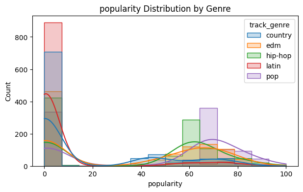
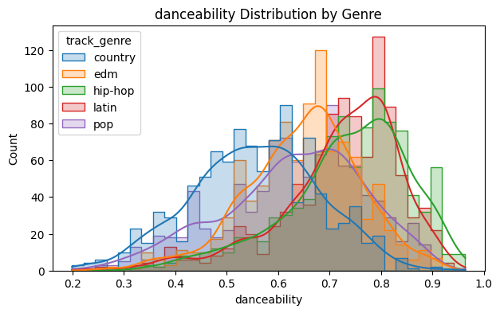
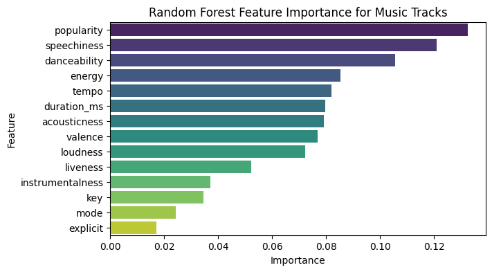

# Random Forest Classification


This Jupyter notebook demonstrates how to build a Random Forest classifier to predict music genres from Spotify track audio features. The project uses data from `spotify_tracks.csv` to classify tracks into six genres.
___

## Key Features
- **Data Preparation**: Loads and preprocesses Spotify track data, focusing on audio features
- **Feature Engineering**: Selects relevant audio features and handles missing values
- **Data Scaling**: Uses StandardScaler to normalize features for better model performance
- **Random Forest Model**: Implements a Random Forest classifier with hyperparameter tuning
- **Model Evaluation**: Includes confusion matrix, classification report, and accuracy metrics
- **Feature Importance**: Visualizes which audio features most influence genre classification
___

## Requirements
- Python
- pandas
- numpy
- matplotlib
- seaborn
- scikit-learn
- Jupyter Notebook
___

## Installing Python dependencies

I recommend using **Python 3.7 or higher** for this project. If you do not have Python installed in your local environment, please visit [python.org](https://www.python.org/downloads/) for the latest download instruction. 

Verify installation with: `python --version`

With Python installed, please go to the Command Line interface of your operating system and use the `pip install` prompts below to install Pandas, NumPy, Matplotlib, Seaborn and scikit-learn respectively. 

### Package Installation
Run these commands in your terminal/command prompt:

```bash
pip install pandas numpy matplotlib seaborn scikit-learn
```
___

## Jupyter Notebook (Optional)

The project is provided as a Jupyter Notebook (`.ipynb` file). You have two options:

### 1. Install Jupyter (recommended for full interactivity):

```bash
pip install jupyter
```

### 2. View without installation:
- Use Google Colab
___

## Popularity Distribution
*Distribution of track popularity across different music genres.*
- Scale: Popularity scores (unlabeled range) are grouped by genre, with counts on the y-axis.
- Trend: Pop and hip-hop dominate higher popularity counts, while country and EDM show narrower distributions.
- Insight: The plot suggests genre plays a significant role in track popularity, with pop consistently leading.
- Limitation: Exact popularity values are not specified, requiring further analysis for precise comparisons.

  


## Danceability Distribution
*Danceability Distribution by Genre.*
- Scale: Danceability scores range from 0.2 to 1.0, with counts displayed on the y-axis.
- Trend: EDM and pop tracks exhibit higher danceability, while country and hip-hop show broader variability.
- Alignment: Genres like Latin and hip-hop cluster around mid-range scores, reflecting genre-specific rhythmic patterns.
- Outliers: Some pop and EDM tracks reach near-maximum danceability, emphasizing their upbeat nature.

  


## Feature Importance in Music Tracks
*Random Forest analysis of key features influencing music tracks.*
- Scale: The x-axis ranges from 0.00 to 0.12, representing the importance score of each feature.
- Key Features: Popularity, speechiness, and danceability are the most influential factors, while mode and explicit have minimal impact.
- Insight: The model highlights audio attributes like energy and acousticness as moderately important, suggesting they contribute to track performance.
- Variability: Features like instrumentalness and liveness show lower importance, indicating their limited role in the model's predictions.

  

## License
```
MIT License

Copyright (c) 2025 Ilija Mihajlovic

Permission is hereby granted, free of charge, to any person obtaining a copy
of this software and associated documentation files (the "Software"), to deal
in the Software without restriction, including without limitation the rights
to use, copy, modify, merge, publish, distribute, sublicense, and/or sell
copies of the Software, and to permit persons to whom the Software is
furnished to do so, subject to the following conditions:

The above copyright notice and this permission notice shall be included in all
copies or substantial portions of the Software.

THE SOFTWARE IS PROVIDED "AS IS", WITHOUT WARRANTY OF ANY KIND, EXPRESS OR
IMPLIED, INCLUDING BUT NOT LIMITED TO THE WARRANTIES OF MERCHANTABILITY,
FITNESS FOR A PARTICULAR PURPOSE AND NON-INFRINGEMENT. IN NO EVENT SHALL THE
AUTHORS OR COPYRIGHT HOLDERS BE LIABLE FOR ANY CLAIM, DAMAGES OR OTHER
LIABILITY, WHETHER IN AN ACTION OF CONTRACT, TORT OR OTHERWISE, ARISING FROM,
OUT OF OR IN CONNECTION WITH THE SOFTWARE OR THE USE OR OTHER DEALINGS IN THE
SOFTWARE.

```
